<html>

<h1>
Memes!
</h1>
<h2>You can suggest memes to put on here by e-mailing <a href="mailto:puzzledude98@outlook.com?subject=Meme%20Suggestion">puzzledude98@outlook.com</a> your memes!</h2>

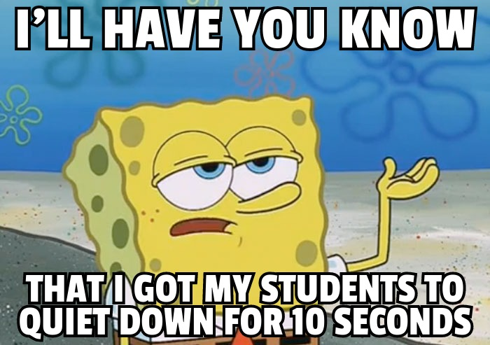
 

 
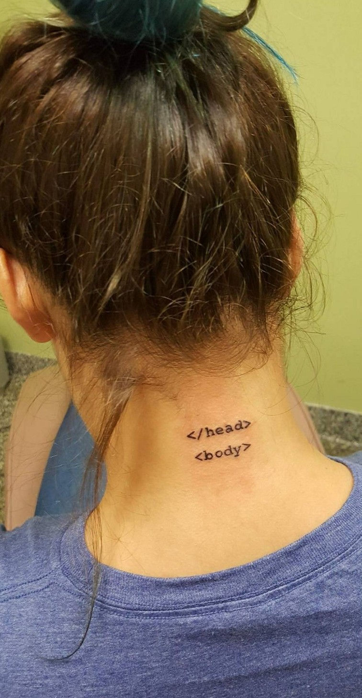
 
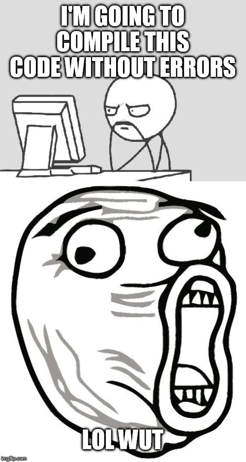
 
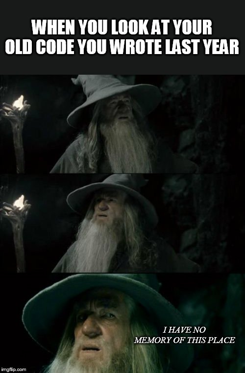
 
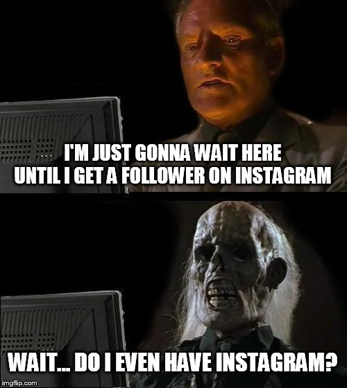
 
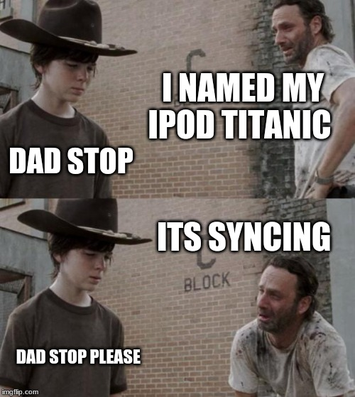
 
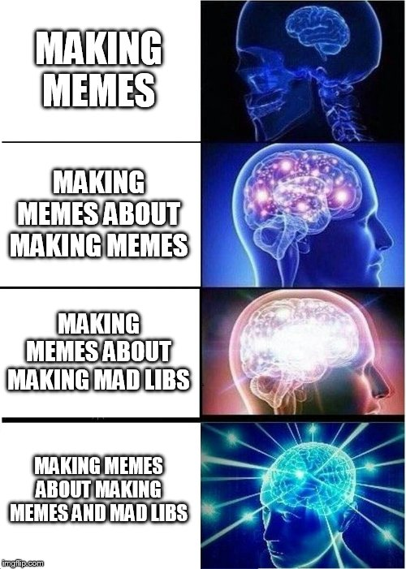
 
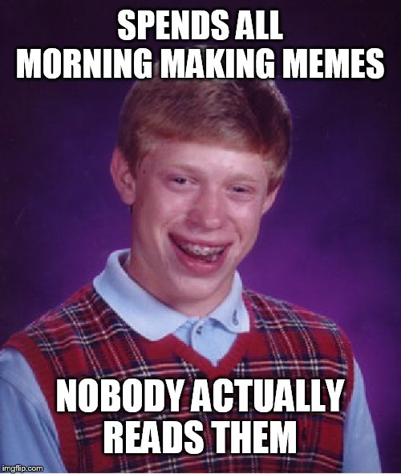
 
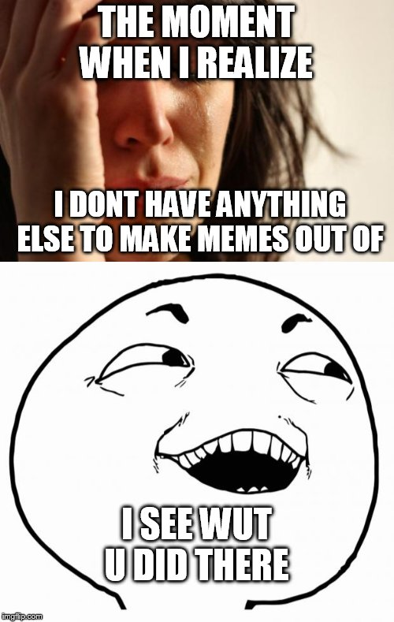
 

 
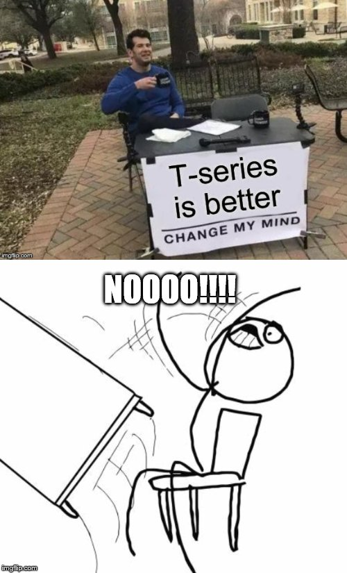
 
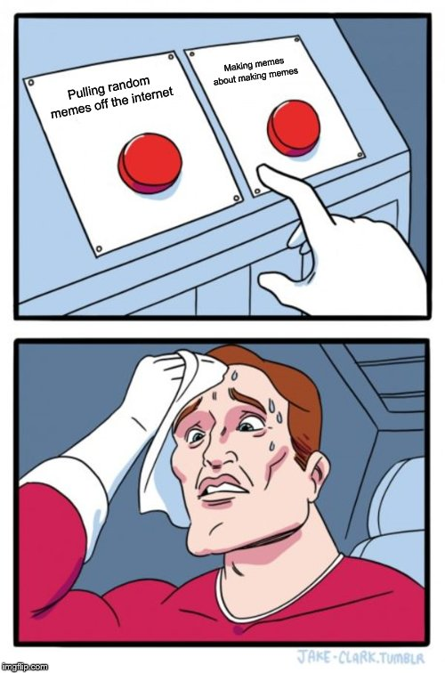
 
<button onclick="window.location.href = 'scarymemes';">HALLOWEEN Memes! (viewer discretion is advised)</button>
 
<button onclick="window.location.href = 'index';">Back to home page</button>
