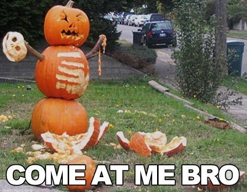
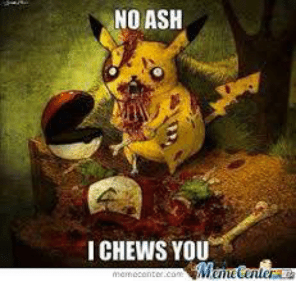

<html>

<h1>
Halloween Memes!
</h1>
<h2>Viewer discretion is advised</h2>

Scroll down to view
 
Scroll down to view
 
Scroll down to view
 
Scroll down to view
 
Scroll down to view
 
Scroll down to view
 
Scroll down to view
 
Scroll down to view
 
Scroll down to view
 
Scroll down to view
 
Scroll down to view
 
Scroll down to view
 
Scroll down to view
 
Scroll down to view
 
Scroll down to view
 
Scroll down to view
 
Scroll down to view
 
Scroll down to view
 
Scroll down to view
 
Scroll down to view
 
Scroll down to view
 
Scroll down to view
 
Scroll down to view
 
Scroll down to view
 

 

 
<button onclick="window.location.href = 'memes';">Back to memes</button>
